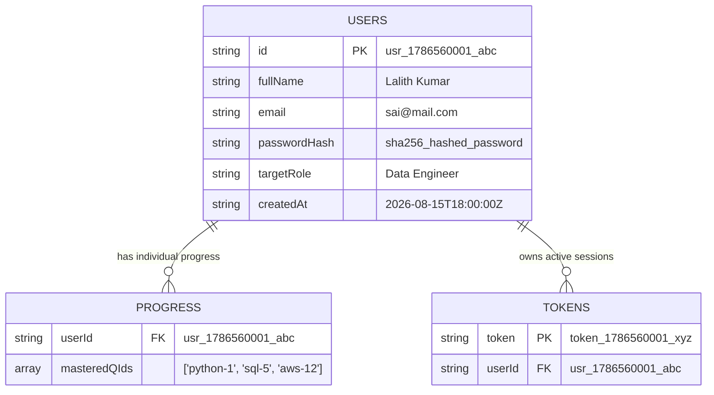

# 🗄️ Database Architecture & Configuration Documentation

Welcome to the **Data Engineer Preparation Suite** Database Documentation. This guide explains which database is currently used, how user authentication & individual progress tracking work, and how to connect to external databases like **PostgreSQL** or **MySQL**.

---

## 📌 1. Which Database Do We Currently Use?

By default, the application uses an **Embedded Lightweight File Database** (`server/data_store.json`) powered by **Node.js Express API** ([`server/server.js`](file:///d:/Data%20Engneer%20Preparation/server/server.js)).

### Why is this used as default?
1. **Zero Setup Required**: Works instantly out of the box without requiring you to install PostgreSQL, MySQL, or MongoDB on your machine.
2. **Fast In-Memory Caching & Atomic Storage**: Reads data instantly into memory and writes updates atomically to disk.
3. **Data Persistence**: All registered user accounts and question progress survive server restarts.

---

## 📊 2. Database Schema Structure

The database maintains 3 core relational tables/collections:



---

## ⚙️ 3. How to Configure & Connect External Databases (PostgreSQL / MySQL)

All database settings are managed centrally through the root **[`.env`](file:///d:/Data%20Engneer%20Preparation/.env)** file:

### `.env` File Credentials:

```env
# ----------------------------------------------------
# BACKEND SERVER CONFIGURATION
# ----------------------------------------------------
PORT=5000
NODE_ENV=development

# ----------------------------------------------------
# DATABASE SELECTION & CREDENTIALS
# ----------------------------------------------------
# Supported DB_TYPE values: 'sqlite' | 'postgres' | 'mysql'
DB_TYPE=sqlite

# Enterprise DB Host & Port (When DB_TYPE=postgres or mysql)
DB_HOST=localhost
DB_PORT=5432
DB_USER=postgres
DB_PASSWORD=your_actual_password
DB_NAME=data_engineer_prep_db

# ----------------------------------------------------
# AUTHENTICATION SECRET
# ----------------------------------------------------
JWT_SECRET=de_prep_super_secret_jwt_key_2026
```

---

## 🔌 4. API Endpoints Summary

The backend Express server (`server/server.js`) exposes the following REST APIs:

| HTTP Method | Endpoint | Description | Auth Required |
|---|---|---|---|
| **`POST`** | `/api/auth/signup` | Registers a new user account & hashes password | ❌ No |
| **`POST`** | `/api/auth/signin` | Validates credentials & returns authorization token | ❌ No |
| **`GET`** | `/api/auth/me` | Fetches current user profile | ✅ Yes (`Bearer token`) |
| **`GET`** | `/api/user/progress` | Fetches individual user's mastered question list | ✅ Yes (`Bearer token`) |
| **`POST`** | `/api/user/progress` | Saves individual user's mastered question list | ✅ Yes (`Bearer token`) |

---

## 🚀 5. How to Run the Database Backend

1. **Start the Express Auth API Server**:
   ```bash
   node server/server.js
   ```
   *Output*: `🚀 Authentication & Database Backend API running on http://localhost:5000`

2. **Start the Frontend Web App**:
   ```bash
   npm run dev
   ```
   *Output*: `Vite dev server running on http://localhost:3000`
