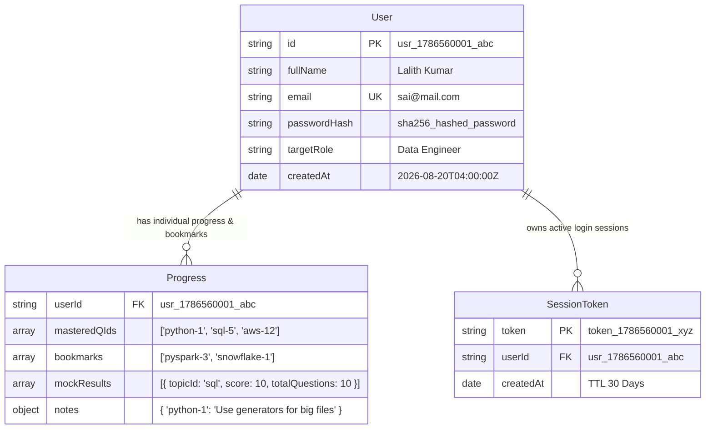

# 🗄️ MongoDB Database Architecture & Deployment Documentation

Welcome to the **Data Engineer Preparation Suite** Database Documentation. This guide explains how the **MongoDB** backend database is structured, how user authentication & individual progress tracking work, and how to deploy the application with MongoDB Atlas on cloud platforms like **Vercel, Render, Railway, or Netlify**.

---

## 📌 1. Database Architecture & Setup

The application uses **MongoDB** connected via **Mongoose ORM** (`server/db.js`) powered by a **Node.js Express REST API** (`server/server.js`).

### Core Highlights:
1. **Cloud & Production Ready**: Uses `MONGODB_URI` environment variable for MongoDB Atlas deployment.
2. **Atomic Fail-Safe Local Mode**: If MongoDB is starting up or offline, the server automatically degrades gracefully to an atomic local store without crashing.
3. **Persisted Data**: User accounts, mastered question lists, mock practice test scores, bookmarks, and custom notes are stored permanently in MongoDB.

---

## 📊 2. MongoDB Mongoose Collections & Schema Structure

The database maintains 3 core collections:



---

## ⚙️ 3. Environment Variables Configuration (`.env`)

All database credentials and backend API URLs are managed centrally in the root **[`.env`](file:///d:/Data%20Engneer%20Preparation/.env)** file:

```env
# ----------------------------------------------------
# BACKEND SERVER CONFIGURATION
# ----------------------------------------------------
PORT=5000
NODE_ENV=development

# ----------------------------------------------------
# MONGODB DATABASE CONFIGURATION
# Local MongoDB: mongodb://127.0.0.1:27017/data_engineer_prep_db
# Cloud MongoDB Atlas (for Vercel / Render / Railway):
# MONGODB_URI=mongodb+srv://<username>:<password>@cluster0.mongodb.net/data_engineer_prep?retryWrites=true&w=majority
# ----------------------------------------------------
MONGODB_URI=mongodb://127.0.0.1:27017/data_engineer_prep_db

# ----------------------------------------------------
# FRONTEND API BASE URL (FOR DEPLOYMENT)
# Set VITE_API_BASE_URL to your deployed backend API endpoint
# ----------------------------------------------------
VITE_API_BASE_URL=http://localhost:5000/api

# ----------------------------------------------------
# AUTHENTICATION SECRET
# ----------------------------------------------------
JWT_SECRET=de_prep_super_secret_jwt_key_2026
```

---

## 🌐 4. Why Sign-In Failed After Deployment & How It Is Fixed

### Cause of Post-Deployment Sign-In Failure:
1. **Hardcoded Local API Base**: Frontends deployed to Vercel/Netlify tried to call `http://localhost:5000/api`, which fails on external user devices.
2. **Serverless Ephemeral File Systems**: Hosting providers wipe or restrict local file writes (`data_store.json`), causing auth operations to fail.

### The Solution Applied:
- **`VITE_API_BASE_URL` Support**: Updated `src/App.jsx` and `src/components/auth/AuthPage.jsx` to dynamically read `import.meta.env.VITE_API_BASE_URL || 'http://localhost:5000/api'`.
- **MongoDB Atlas Integration**: Converted `server/server.js` to persist users, tokens, and progress into **MongoDB**, which works seamlessly on serverless platforms.

---

## 🔌 5. REST API Endpoints Summary

| HTTP Method | Endpoint | Description | Auth Required |
|---|---|---|---|
| **`GET`** | `/api/health` | Checks backend API and MongoDB connection state | ❌ No |
| **`POST`** | `/api/auth/signup` | Registers new user in MongoDB and creates session | ❌ No |
| **`POST`** | `/api/auth/signin` | Validates password hash against MongoDB & returns token | ❌ No |
| **`GET`** | `/api/auth/me` | Fetches current user profile from MongoDB | ✅ Yes (`Bearer token`) |
| **`GET`** | `/api/user/progress` | Fetches individual user's mastered question list | ✅ Yes (`Bearer token`) |
| **`POST`** | `/api/user/progress` | Saves individual user's mastered question list | ✅ Yes (`Bearer token`) |
| **`GET`** | `/api/user/bookmarks` | Fetches user's bookmarked questions (Future Feature) | ✅ Yes (`Bearer token`) |
| **`POST`** | `/api/user/bookmarks` | Saves user's bookmarked questions | ✅ Yes (`Bearer token`) |

---

## 🚀 6. Step-by-Step Production Deployment Guide

### A. Deploy Backend API to Render / Railway:
1. Push repository to GitHub.
2. Create a new Web Service on **Render** (or **Railway**).
3. Set **Build Command**: `npm install`
4. Set **Start Command**: `npm run server`
5. Add Environment Variables:
   - `MONGODB_URI`: `mongodb+srv://<username>:<password>@cluster.mongodb.net/data_engineer_prep?retryWrites=true&w=majority`
   - `JWT_SECRET`: your secret key

### B. Deploy Frontend to Vercel / Netlify:
1. Create a new project on **Vercel**.
2. Set Environment Variable:
   - `VITE_API_BASE_URL`: `https://your-backend-api.onrender.com/api`
3. Click **Deploy**.
